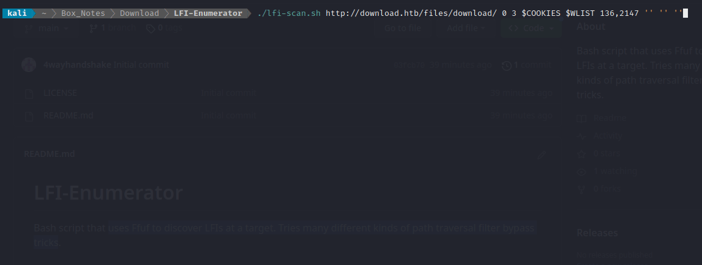

# LFI-Enumerator
Bash script that uses **Ffuf** to discover LFIs at a target. Tries many different kinds of path traversal filter bypass tricks.

When looking for a tool that would try path traversals using a variety of different filter bypass methods, I found that the existing tools were either a bit too limited or a bit too complicated, so I made my own. 

It's not pretty, but it seems to work just fine.


## Usage

```
Usage: ./lfi-scan.sh <target> <min> <max> <cookies> <wordlist> <filter_size> <extensions> <initial> <final>
```

> All arguments are required. Many of them can accept an empty string `''` if you don't want to use that option.

If desired, add entries to `lfi-list.txt` to try additional  path traversal tricks or encodings.


## Example

It's easiest to use if you set a couple of `bash` variables first:

```bash
WLIST=/path/to/wordlist/of/filenames.txt
COOKIES='key1=value1;key2=value2'
```

Then just run the script. For example:

```bash
./lfi-scan.sh http://target.htb/?page= 0 3 $COOKIES $WLIST 136,2147 '-e .php,.html,.js,.txt' '/' '%00'
```

> The above command would...
>
> - Target an LFI rooted at `http://download.htb/files/download/`
> - Have a minimum of 0 backwards traversals
> - Have a maximum of 3 backwards traversals
> - Use the cookies stored in `$COOKIES`
> - Use the filename wordlist at `$WLIST`. 
>   It's best to use a fairly short wordlist of likely filenames or paths here (like `index.html` or `/etc/passwd` or `app.js`). 
> - Filter out all results off size 136 bytes or 2147 bytes 
> - Extend the FUZZ keyword using the provided file extensions. 
>   If this option is not empty (`''`), it's best to use
> - Prepend the traversal path with a `/`
> - Append a null byte %00 to the end of every request

:point_up: If you don't know what to use for the size filter, just run some regular ffuf scans first and discover which sizes are the result of a *failed* LFI attempt. 




---

Enjoy

:handshake::handshake::handshake::handshake:
@4wayhandshake
